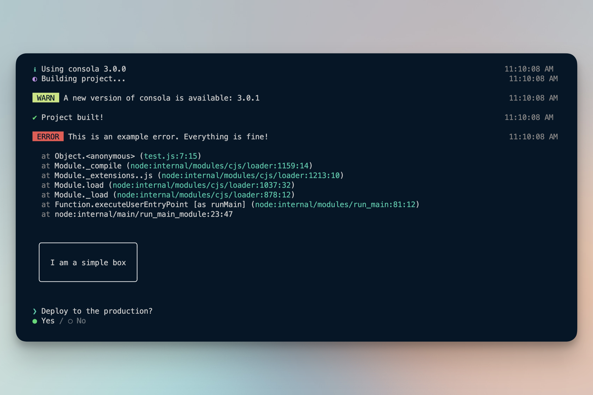
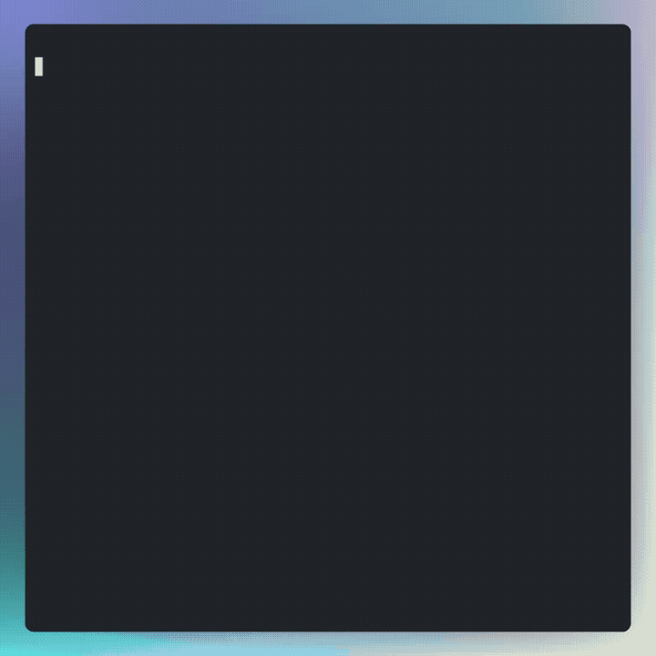
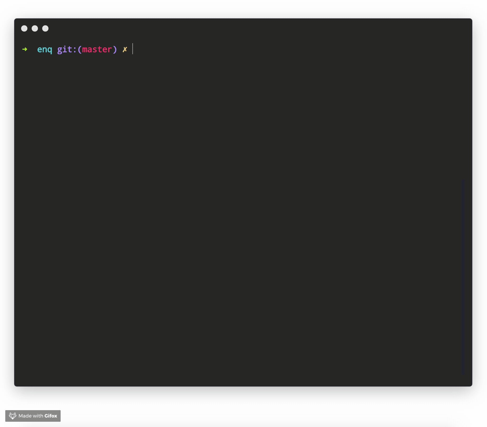
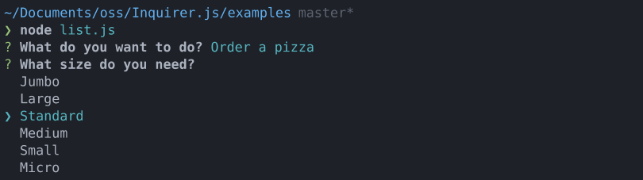

# CLI App Demo

This project showcases different libraries for building Command Line Interface (CLI) tools in Node.js. Each file in this repository demonstrates the usage of a specific library.

## Libraries Showcased

### 1. Tasuku

**Description**: A minimal task runner for Node.js. It helps verify tasks, display loading states, and handle nested or parallel tasks easily.  
**Demo File**: `tasku.ts`  
**Repository**: [https://github.com/guanzo/tasuku](https://github.com/guanzo/tasuku)

---

### 2. Consola

**Description**: An elegant Console Wrapper for Node.js and Browser. It provides unified logging with fallbacks, pause/resume, and mock capabilities.  
**Demo File**: `consola.ts`  
**Repository**: [https://github.com/unjs/consola](https://github.com/unjs/consola)

---

### 3. Ink

**Description**: React for interactive command-line apps. It allows building CLI output using React components, handling layout (Flexbox) and reactivity.  
**Demo File**: `ink.tsx`  
**Repository**: [https://github.com/vadimdemedes/ink](https://github.com/vadimdemedes/ink)

---

### 4. Clack Prompts

**Description**: Modern, simple, and interactive command-line prompts. Uses a clean UI style to make CLI interactions feel professional.  
**Demo File**: `clack.ts`  
**Repository**: [https://github.com/bombshell-dev/clack](https://github.com/bombshell-dev/clack)

---

### 5. Enquirer

**Description**: Stylish, intuitive, and user-friendly prompts. Fast and lightweight.  
**Demo File**: `enquirer.ts`  
**Repository**: [https://github.com/enquirer/enquirer](https://github.com/enquirer/enquirer)

---

### 6. Inquirer

**Description**: A collection of common interactive command line user interfaces. The classic choice for asking questions in the terminal.  
**Demo File**: `inquirer.ts`  
**Repository**: [https://github.com/SBoudrias/Inquirer.js](https://github.com/SBoudrias/Inquirer.js)

